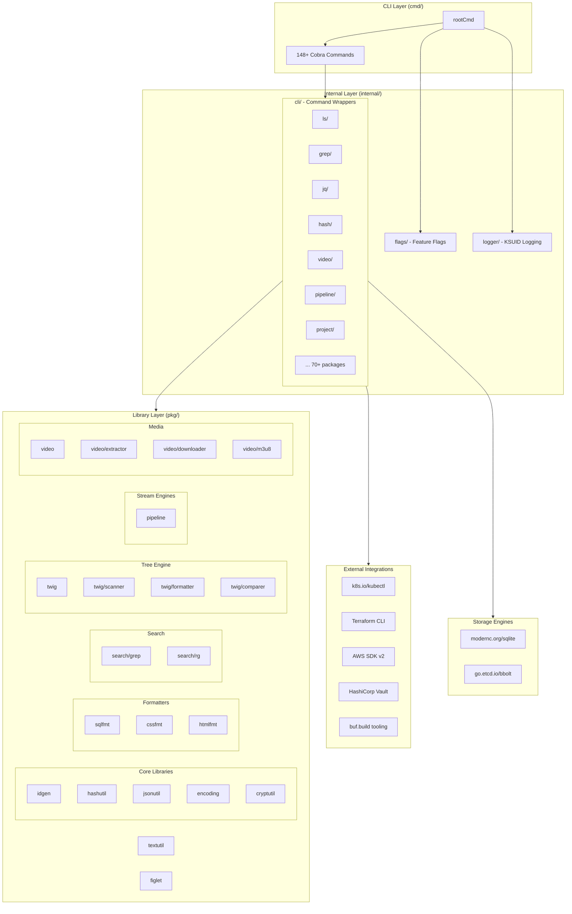
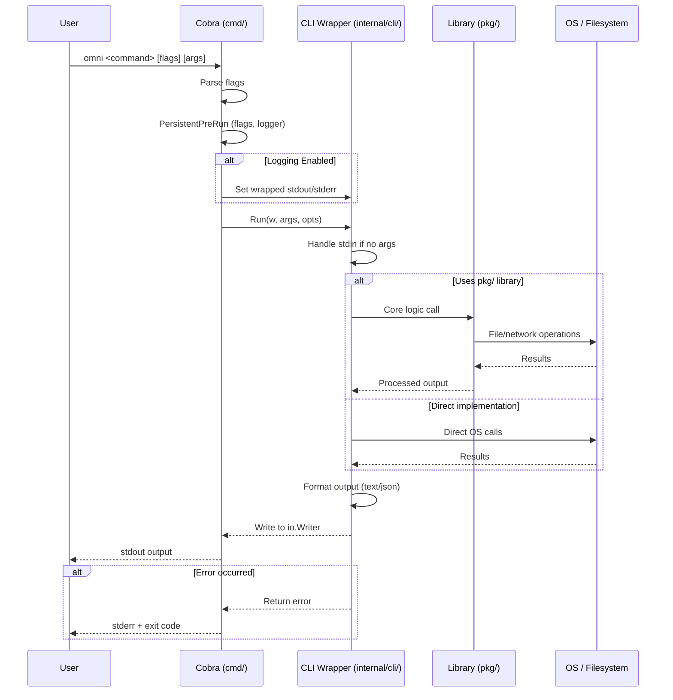
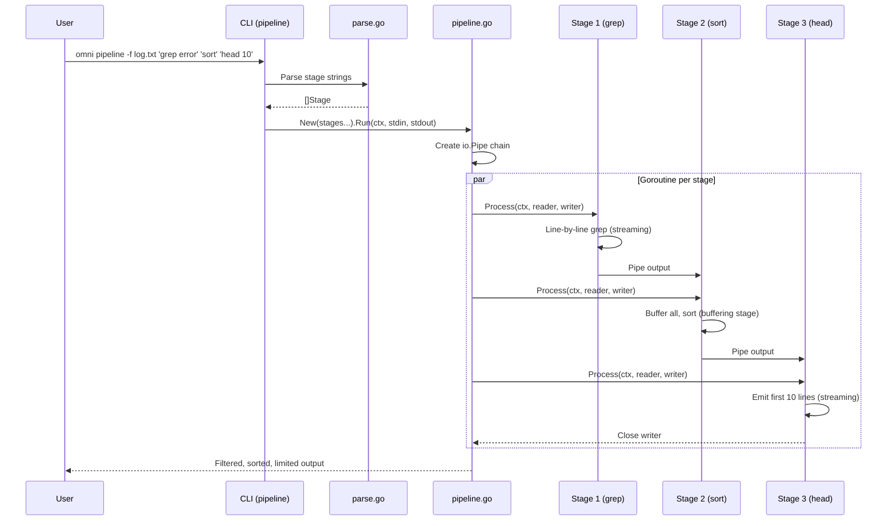
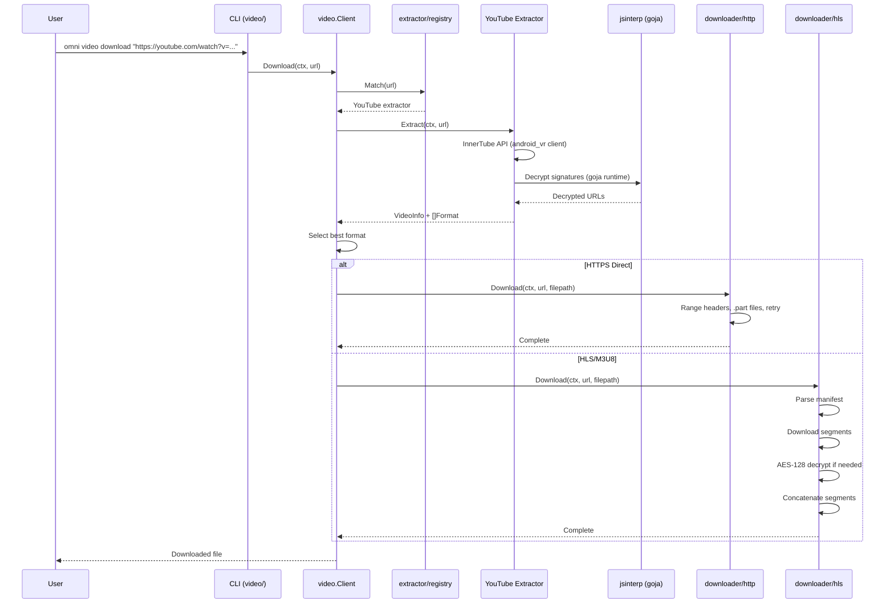
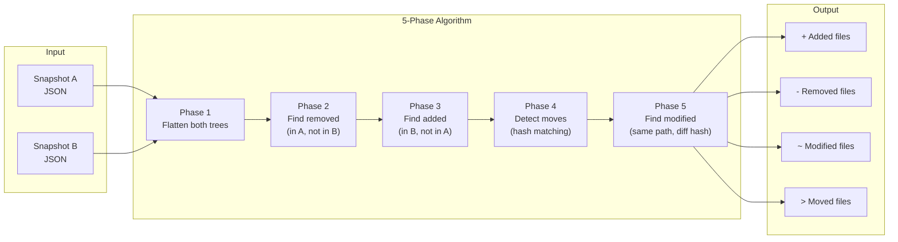

# Architecture

## System Overview

```mermaid
flowchart TB
    subgraph CLI["CLI Layer (cmd/)"]
        Root[rootCmd]
        Cmds[148+ Cobra Commands]
        Root --> Cmds
    end

    subgraph Internal["Internal Layer (internal/)"]
        subgraph CLIWrappers["cli/ - Command Wrappers"]
            LS[ls/]
            Grep[grep/]
            JQ[jq/]
            Hash[hash/]
            Video[video/]
            Pipeline[pipeline/]
            Project[project/]
            More["... 70+ packages"]
        end
        Flags[flags/ - Feature Flags]
        Logger[logger/ - KSUID Logging]
    end

    subgraph Pkg["Library Layer (pkg/)"]
        subgraph Core["Core Libraries"]
            IDGen[idgen]
            HashUtil[hashutil]
            JSONUtil[jsonutil]
            Encoding[encoding]
            CryptUtil[cryptutil]
        end
        subgraph Format["Formatters"]
            SQLFmt[sqlfmt]
            CSSFmt[cssfmt]
            HTMLFmt[htmlfmt]
        end
        subgraph Search["Search"]
            GrepPkg[search/grep]
            RGPkg[search/rg]
        end
        subgraph Tree["Tree Engine"]
            Twig[twig]
            Scanner[twig/scanner]
            Formatter[twig/formatter]
            Comparer[twig/comparer]
        end
        subgraph Stream["Stream Engines"]
            PipelinePkg[pipeline]
        end
        subgraph Media["Media"]
            VideoPkg[video]
            Extractor[video/extractor]
            Downloader[video/downloader]
            M3U8[video/m3u8]
        end
        TextUtil[textutil]
        Figlet[figlet]
    end

    subgraph External["External Integrations"]
        K8s[k8s.io/kubectl]
        TF["Terraform CLI"]
        AWS["AWS SDK v2"]
        Vault["HashiCorp Vault"]
        Buf["buf.build tooling"]
    end

    subgraph Storage["Storage Engines"]
        SQLite[modernc.org/sqlite]
        BBolt[go.etcd.io/bbolt]
    end

    Cmds --> CLIWrappers
    CLIWrappers --> Pkg
    CLIWrappers --> External
    CLIWrappers --> Storage
    Root --> Flags
    Root --> Logger
```

## Command Execution Flow

```mermaid
sequenceDiagram
    participant User
    participant Cobra as Cobra (cmd/)
    participant CLI as CLI Wrapper (internal/cli/)
    participant Pkg as Library (pkg/)
    participant OS as OS / Filesystem

    User->>Cobra: omni <command> [flags] [args]
    Cobra->>Cobra: Parse flags
    Cobra->>Cobra: PersistentPreRun (flags, logger)

    alt Logging Enabled
        Cobra->>CLI: Set wrapped stdout/stderr
    end

    Cobra->>CLI: Run(w, args, opts)
    CLI->>CLI: Handle stdin if no args

    alt Uses pkg/ library
        CLI->>Pkg: Core logic call
        Pkg->>OS: File/network operations
        OS-->>Pkg: Results
        Pkg-->>CLI: Processed output
    else Direct implementation
        CLI->>OS: Direct OS calls
        OS-->>CLI: Results
    end

    CLI->>CLI: Format output (text/json)
    CLI-->>Cobra: Write to io.Writer
    Cobra-->>User: stdout output

    alt Error occurred
        CLI-->>Cobra: Return error
        Cobra-->>User: stderr + exit code
    end
```

## Pipeline Engine Flow

```mermaid
sequenceDiagram
    participant User
    participant CLI as CLI (pipeline)
    participant Parser as parse.go
    participant Engine as pipeline.go
    participant S1 as Stage 1 (grep)
    participant S2 as Stage 2 (sort)
    participant S3 as Stage 3 (head)

    User->>CLI: omni pipeline -f log.txt 'grep error' 'sort' 'head 10'
    CLI->>Parser: Parse stage strings
    Parser-->>CLI: []Stage

    CLI->>Engine: New(stages...).Run(ctx, stdin, stdout)
    Engine->>Engine: Create io.Pipe chain

    par Goroutine per stage
        Engine->>S1: Process(ctx, reader, writer)
        S1->>S1: Line-by-line grep (streaming)
        S1->>S2: Pipe output

        Engine->>S2: Process(ctx, reader, writer)
        S2->>S2: Buffer all, sort (buffering stage)
        S2->>S3: Pipe output

        Engine->>S3: Process(ctx, reader, writer)
        S3->>S3: Emit first 10 lines (streaming)
        S3-->>Engine: Close writer
    end

    Engine-->>User: Filtered, sorted, limited output
```

## Video Download Flow

```mermaid
sequenceDiagram
    participant User
    participant CLI as CLI (video/)
    participant Client as video.Client
    participant Registry as extractor/registry
    participant YT as YouTube Extractor
    participant JS as jsinterp (goja)
    participant DL as downloader/http
    participant HLS as downloader/hls

    User->>CLI: omni video download "https://youtube.com/watch?v=..."
    CLI->>Client: Download(ctx, url)
    Client->>Registry: Match(url)
    Registry-->>Client: YouTube extractor

    Client->>YT: Extract(ctx, url)
    YT->>YT: InnerTube API (android_vr client)
    YT->>JS: Decrypt signatures (goja runtime)
    JS-->>YT: Decrypted URLs
    YT-->>Client: VideoInfo + []Format

    Client->>Client: Select best format

    alt HTTPS Direct
        Client->>DL: Download(ctx, url, filepath)
        DL->>DL: Range headers, .part files, retry
        DL-->>Client: Complete
    else HLS/M3U8
        Client->>HLS: Download(ctx, url, filepath)
        HLS->>HLS: Parse manifest
        HLS->>HLS: Download segments
        HLS->>HLS: AES-128 decrypt if needed
        HLS->>HLS: Concatenate segments
        HLS-->>Client: Complete
    end

    Client-->>User: Downloaded file
```

## Tree Comparison Flow

```mermaid
flowchart LR
    subgraph Input
        A[Snapshot A<br/>JSON]
        B[Snapshot B<br/>JSON]
    end

    subgraph "5-Phase Algorithm"
        P1["Phase 1<br/>Flatten both trees"]
        P2["Phase 2<br/>Find removed<br/>(in A, not in B)"]
        P3["Phase 3<br/>Find added<br/>(in B, not in A)"]
        P4["Phase 4<br/>Detect moves<br/>(hash matching)"]
        P5["Phase 5<br/>Find modified<br/>(same path, diff hash)"]
    end

    subgraph Output
        Added[" + Added files"]
        Removed[" - Removed files"]
        Modified[" ~ Modified files"]
        Moved[" > Moved files"]
    end

    A --> P1
    B --> P1
    P1 --> P2 --> P3 --> P4 --> P5
    P5 --> Added
    P5 --> Removed
    P5 --> Modified
    P5 --> Moved
```

## Package Dependency Graph

```mermaid
flowchart TB
    cmd --> internal/cli
    internal/cli --> pkg/idgen
    internal/cli --> pkg/hashutil
    internal/cli --> pkg/jsonutil
    internal/cli --> pkg/encoding
    internal/cli --> pkg/cryptutil
    internal/cli --> pkg/sqlfmt
    internal/cli --> pkg/cssfmt
    internal/cli --> pkg/htmlfmt
    internal/cli --> pkg/textutil
    internal/cli --> pkg/search/grep
    internal/cli --> pkg/search/rg
    internal/cli --> pkg/twig
    internal/cli --> pkg/pipeline
    internal/cli --> pkg/video

    pkg/twig --> pkg/twig/scanner
    pkg/twig --> pkg/twig/formatter
    pkg/twig --> pkg/twig/comparer
    pkg/twig --> pkg/twig/models
    pkg/twig --> pkg/twig/builder
    pkg/twig --> pkg/twig/parser
    pkg/twig --> pkg/twig/expander

    pkg/video --> pkg/video/extractor
    pkg/video --> pkg/video/downloader
    pkg/video --> pkg/video/format
    pkg/video --> pkg/video/m3u8
    pkg/video --> pkg/video/nethttp
    pkg/video --> pkg/video/jsinterp
    pkg/video --> pkg/video/cache
    pkg/video --> pkg/video/utils
    pkg/video --> pkg/video/types

    pkg/textutil --> pkg/textutil/diff
```
