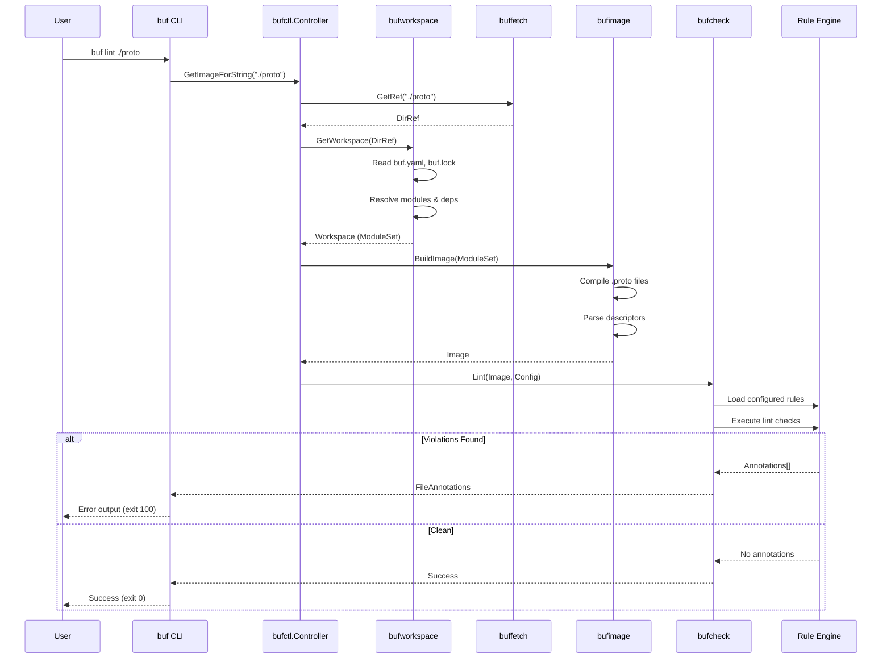
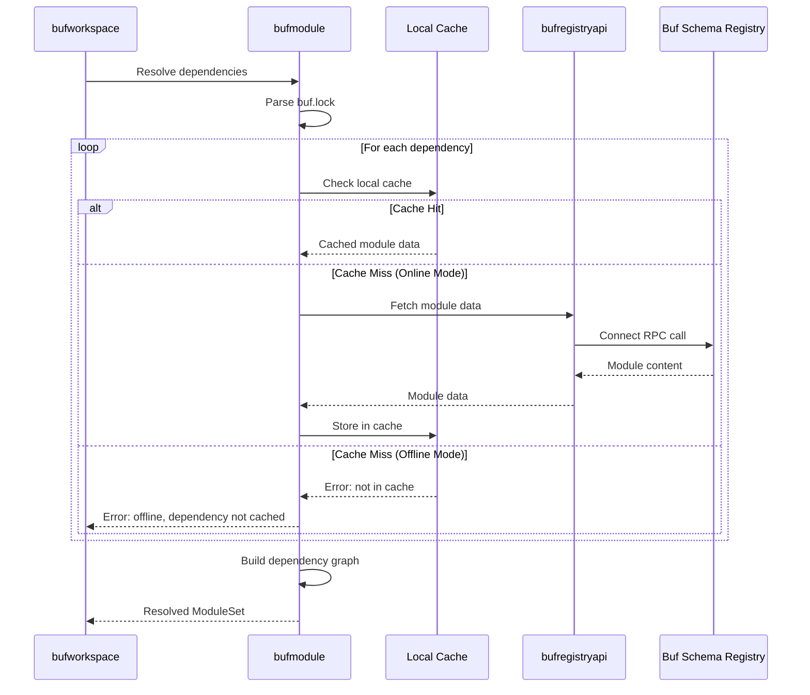
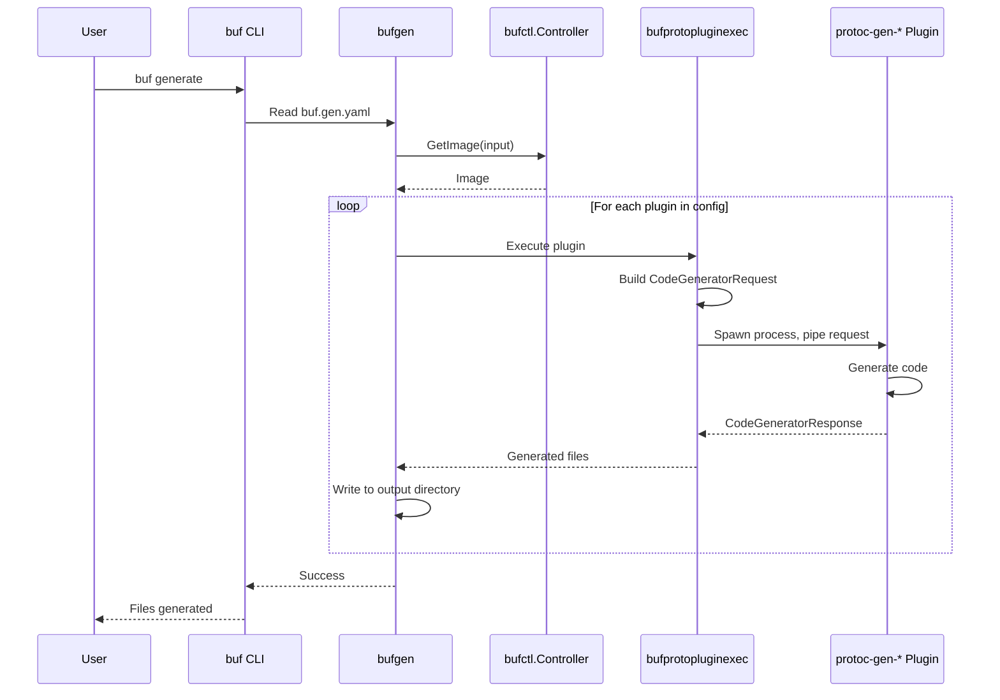
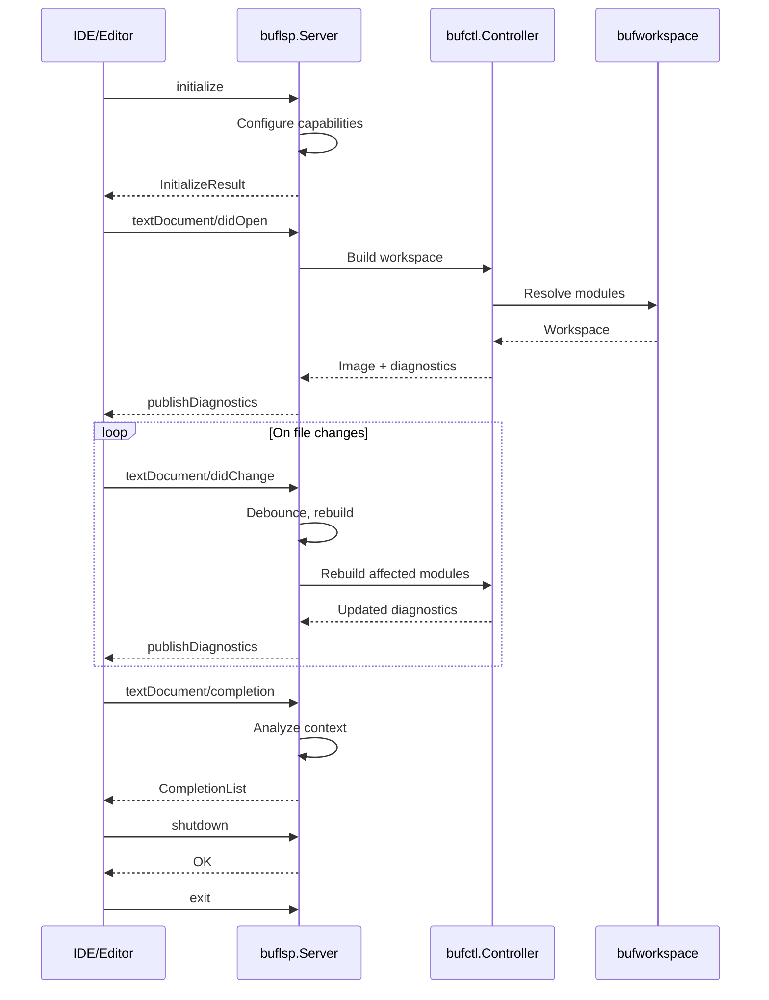

# Architecture

## System Overview

```mermaid
flowchart TB
    subgraph CLI["cmd/ - CLI Binaries"]
        buf["buf"]
        pgbb["protoc-gen-buf-breaking"]
        pgbl["protoc-gen-buf-lint"]
    end

    subgraph BufCore["internal/buf/ - Core Logic (36 packages)"]
        bufcli["bufcli<br/>CLI bootstrap, version,<br/>caching, offline mode"]
        bufctl["bufctl<br/>Controller: orchestrates<br/>build/lint/breaking/push"]
        bufworkspace["bufworkspace<br/>Workspace resolution"]
        buffetch["buffetch<br/>Input fetching<br/>(git, archive, dir, module)"]
        buflsp["buflsp<br/>Language Server Protocol"]

        subgraph Check["Check Engine"]
            bufcheck["bufcheck<br/>Rule engine"]
            bufconfig["bufconfig<br/>buf.yaml / buf.gen.yaml<br/>parsing"]
        end

        subgraph Image["Image Pipeline"]
            bufimage["bufimage<br/>Protobuf image<br/>representation"]
            bufprotocompile["bufprotocompile<br/>Proto compilation"]
            bufprotosource["bufprotosource<br/>Source info extraction"]
        end

        subgraph Module["Module System"]
            bufmodule["bufmodule<br/>Module/dep management"]
            bufcas["bufcas<br/>Content-addressable store"]
        end

        subgraph CodeGen["Code Generation"]
            bufgen["bufgen<br/>Generation orchestration"]
            bufprotoplugin["bufprotoplugin<br/>Plugin protocol"]
            bufprotopluginexec["bufprotopluginexec<br/>Plugin execution"]
        end

        subgraph Registry["Registry Integration"]
            bufregistryapi["bufregistryapi<br/>BSR API clients"]
            bufplugin["bufplugin<br/>Plugin management"]
            bufpolicy["bufpolicy<br/>Policy management"]
        end
    end

    subgraph Pkg["internal/pkg/ - Generic Utilities (47 packages)"]
        storage["storage<br/>Virtual filesystem"]
        protoencoding["protoencoding<br/>Proto marshal/unmarshal"]
        thread["thread<br/>Concurrency (Parallelize)"]
        git["git<br/>Git operations"]
        app["app<br/>CLI framework"]
        protovalidate["protovalidate<br/>Proto validation"]
    end

    subgraph GenCode["internal/gen/ - Generated Code"]
        genproto["gen/proto/go<br/>Protobuf Go types"]
        genconnect["gen/proto/connect<br/>Connect RPC clients"]
        genext["gen/ext<br/>Inlined BSR dependencies"]
    end

    subgraph External["External Systems"]
        BSR["Buf Schema Registry<br/>(buf.build)"]
        GitRemote["Git Repositories"]
        FS["Local Filesystem"]
        Plugins["protoc-gen-* Plugins"]
    end

    buf --> bufcli
    pgbb --> bufcheck
    pgbl --> bufcheck
    bufcli --> bufctl
    bufctl --> bufworkspace
    bufctl --> buffetch
    bufctl --> bufcheck
    bufctl --> bufimage
    bufctl --> bufgen
    bufworkspace --> bufmodule
    buffetch --> storage
    buffetch --> git
    bufcheck --> bufprotosource
    bufimage --> bufprotocompile
    bufgen --> bufprotopluginexec
    bufmodule --> bufcas
    bufmodule --> bufregistryapi
    bufregistryapi --> genconnect
    genconnect --> genproto
    bufregistryapi --> BSR
    buffetch --> GitRemote
    buffetch --> FS
    bufprotopluginexec --> Plugins
    buflsp --> bufctl
```

## Main Request Flow: `buf lint`

```mermaid
sequenceDiagram
    participant User
    participant CLI as buf CLI
    participant Ctl as bufctl.Controller
    participant WS as bufworkspace
    participant Fetch as buffetch
    participant Build as bufimage
    participant Check as bufcheck
    participant Rules as Rule Engine

    User->>CLI: buf lint ./proto
    CLI->>Ctl: GetImageForString("./proto")

    Ctl->>Fetch: GetRef("./proto")
    Fetch-->>Ctl: DirRef

    Ctl->>WS: GetWorkspace(DirRef)
    WS->>WS: Read buf.yaml, buf.lock
    WS->>WS: Resolve modules & deps
    WS-->>Ctl: Workspace (ModuleSet)

    Ctl->>Build: BuildImage(ModuleSet)
    Build->>Build: Compile .proto files
    Build->>Build: Parse descriptors
    Build-->>Ctl: Image

    Ctl->>Check: Lint(Image, Config)
    Check->>Rules: Load configured rules
    Check->>Rules: Execute lint checks

    alt Violations Found
        Rules-->>Check: Annotations[]
        Check-->>CLI: FileAnnotations
        CLI-->>User: Error output (exit 100)
    else Clean
        Rules-->>Check: No annotations
        Check-->>CLI: Success
        CLI-->>User: Success (exit 0)
    end
```

## Module Resolution Flow

```mermaid
sequenceDiagram
    participant WS as bufworkspace
    participant Mod as bufmodule
    participant Cache as Local Cache
    participant API as bufregistryapi
    participant BSR as Buf Schema Registry

    WS->>Mod: Resolve dependencies
    Mod->>Mod: Parse buf.lock

    loop For each dependency
        Mod->>Cache: Check local cache
        alt Cache Hit
            Cache-->>Mod: Cached module data
        else Cache Miss (Online Mode)
            Mod->>API: Fetch module data
            API->>BSR: Connect RPC call
            BSR-->>API: Module content
            API-->>Mod: Module data
            Mod->>Cache: Store in cache
        else Cache Miss (Offline Mode)
            Cache-->>Mod: Error: not in cache
            Mod-->>WS: Error: offline, dependency not cached
        end
    end

    Mod->>Mod: Build dependency graph
    Mod-->>WS: Resolved ModuleSet
```

## Code Generation Flow: `buf generate`

```mermaid
sequenceDiagram
    participant User
    participant CLI as buf CLI
    participant Gen as bufgen
    participant Ctl as bufctl.Controller
    participant Exec as bufprotopluginexec
    participant Plugin as protoc-gen-* Plugin

    User->>CLI: buf generate
    CLI->>Gen: Read buf.gen.yaml
    Gen->>Ctl: GetImage(input)
    Ctl-->>Gen: Image

    loop For each plugin in config
        Gen->>Exec: Execute plugin
        Exec->>Exec: Build CodeGeneratorRequest
        Exec->>Plugin: Spawn process, pipe request
        Plugin->>Plugin: Generate code
        Plugin-->>Exec: CodeGeneratorResponse
        Exec-->>Gen: Generated files
        Gen->>Gen: Write to output directory
    end

    Gen-->>CLI: Success
    CLI-->>User: Files generated
```

## LSP Server Lifecycle

```mermaid
sequenceDiagram
    participant Editor as IDE/Editor
    participant LSP as buflsp.Server
    participant Ctl as bufctl.Controller
    participant WS as bufworkspace

    Editor->>LSP: initialize
    LSP->>LSP: Configure capabilities
    LSP-->>Editor: InitializeResult

    Editor->>LSP: textDocument/didOpen
    LSP->>Ctl: Build workspace
    Ctl->>WS: Resolve modules
    WS-->>Ctl: Workspace
    Ctl-->>LSP: Image + diagnostics
    LSP-->>Editor: publishDiagnostics

    loop On file changes
        Editor->>LSP: textDocument/didChange
        LSP->>LSP: Debounce, rebuild
        LSP->>Ctl: Rebuild affected modules
        Ctl-->>LSP: Updated diagnostics
        LSP-->>Editor: publishDiagnostics
    end

    Editor->>LSP: textDocument/completion
    LSP->>LSP: Analyze context
    LSP-->>Editor: CompletionList

    Editor->>LSP: shutdown
    LSP-->>Editor: OK
    Editor->>LSP: exit
```
